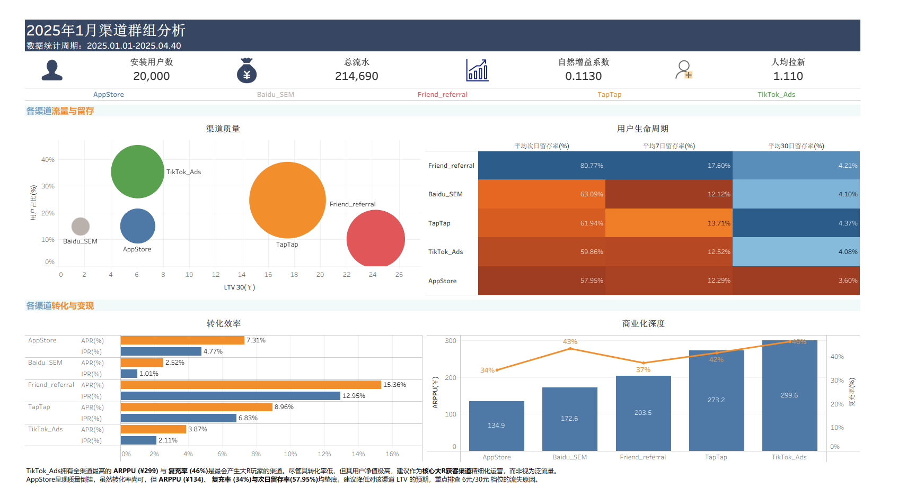

# ⚔️ 手游商业化深度分析

   
---
## 📖 项目简介

本项目基于一款重度卡牌手游的脱敏业务数据（模拟），针对游戏在 **大型活动期间** 的买量投放与用户行为进行了全链路分析。

**数据范围与场景说明:**
数据包含 **20,000 用户** 与 **10,000+ 订单** 的核心业务记录，涵盖三张核心数据表：
1.  **users (用户表)**: 用户基础画像，包含注册时间、渠道归因 (`TikTok`, `TapTap` 等)、激活状态及邀请关系。
2.  **orders (订单表)**: 详细的流水记录，用于计算 ARPPU、LTV 及复充率等指标。
3.  **login_log (活跃日志)**: 用于进行同期群分析及留存计算。

**涉及的投放渠道及其特点（预设）:**
* `TikTok_Ads`: 信息流广告 (高ARPPU，高复充)
* `TapTap`: 垂直游戏社区 (核心玩家，稳健增长)
* `AppStore`: iOS 自然/付费流量 (高转化，低留存)
* `Baidu_SEM`: 搜索引擎营销 (高留存，低转化)
* `Friend_Referral`: 好友邀请/公会裂变 (高LTV，高自然增益)

**核心分析目标:**
1.  **渠道质量评估**: 在多渠道投放策略下，识别高ROI与低效消耗渠道，优化预算分配。
2.  **LTV 预测与拆解**: 分析不同用户群体的生命周期价值，指导广告出价策略。
3.  **增长模型验证**: 量化好友邀请带来的自然增益系数，验证社交裂变效果。

---

## 📈 仪表盘展示



[🔗 **点击查看 Tableau Public 交互式仪表板**](https://public.tableau.com/views/2_17711217860240/20251?:language=en-US&:sid=&:redirect=auth&:display_count=n&:origin=viz_share_link)

---

## 💡 核心商业洞察

基于全链路多维数据分析，本项目明确了手游在活动期间的流量特征与用户价值分层，提出以下核心业务优化方向：

### 1. 价值结构两极化：TikTok_Ads 的大R驱动特征
* **数据表现**: 拥有全渠道最高的 ARPPU (¥299.64) 与复充率 (46.3%)，但受限于极低的付费转化率 (IPR 2.11%)，其 LTV_30 (¥6.06) 仅处于大盘均值，远低于核心渠道。
* **深度分析**: 该渠道流量基数庞大（占比 35%）但非付费用户冗余，严重稀释单用户整体价值。其 GMV 高度依赖极少数高净值大R玩家，呈现典型的大R驱动特征。
* **策略建议**: 转变该渠道的 ROI 考核逻辑，将 KPI 聚焦于大R获客成本。建议投放端采用重度游戏素材前置过滤泛流量，提升整体付费渗透率。

### 2. ROI 风险预警：AppStore 的高转化与低留存
* **数据表现**: 付费转化率较高 (4.77%)，但 ARPPU (¥134.85) 与复充率 (34.27%) 均居末位，导致整体 LTV 受限。
* **深度分析**: 用户呈现短线冲动消费特征，首充意愿强但缺乏长线留存与持续付费动力，在商业模型中属于低净值高周转群体。
* **策略建议**: 下调该渠道的长线 LTV 预期。运营端应将重心向后链路转移，强化次日留存承接与首充后的复购干预。

### 3. 潜在价值洼地：Baidu_SEM 的转化漏斗断层
* **数据表现**: LTV_30 (¥1.71) 垫底，但次日留存 (63.09%) 表现优异，且付费用户复充率 (43.33%) 高居全渠道第二。
* **深度分析**: 用户群呈现高忠诚度与高付费门槛并存的特点，属于价格敏感型核心玩家。高留存验证了产品契合度，低转化暴露出首充破冰环节存在明显断层。
* **策略建议**: 建议针对该渠道用户实施价格歧视策略（如注册24小时内定向推送1折破冰礼包），优先突破首充转化率以释放长线价值。

### 4. 核心增长杠杆：Friend_Referral 的裂变效益
* **数据表现**: LTV_30 (¥24.22) 稳居第一，为 AppStore 的 4 倍，且自然增益系数达到 11.3%。
* **深度分析**: 数据验证了社交裂变是当前版本最高效的获客模型，能够有效稀释买量支出，显著优化综合获客成本结构。
* **策略建议**: 在后续版本中提升好友邀请与公会裂变的奖励权重，将营销预算向高 LTV 的社交裂变链路倾斜。

### 5. 营收基石：TapTap 的高质高量双驱效应
* **数据表现**: 贡献全渠道最高绝对流水 (¥92,058)，LTV_30 (¥17.50) 与 ARPPU (¥273.17) 均稳居前列，且前端激活率高达 76.31%。
* **深度分析**: 作为垂直游戏社区，该渠道精准触达了具备成熟付费习惯的核心玩家。其在保障庞大流量规模 (占比 24.66%) 的同时，维持了极高的变现效率，是支撑整体商业化模型健康运转的基本盘。
* **策略建议**: 确立该渠道为长线稳投基本盘。建议匹配专属社区运营方案或版本首发内容，进一步巩固核心圈层的品牌忠诚度与长周期生命周期价值 (LTV)。

### 6. 商业策略落地与 A/B 测试实验架构
基于前述对 `Baidu_SEM` 渠道首充漏斗断层的诊断，本报告输出的 “注册24小时内定向推送1折破冰礼包” 的价格歧视策略。为量化该策略的真实商业增益与潜在风险，已完成如下A/B测试底层评估管线的架构设计：

* **实验分流引擎**：
    * 针对 `Baidu_SEM` 渠道新增设备ID执行Hash取模。
    * 50%归入Control组（无干预，维持原价档位）；50% 归入Treatment组（破冰特惠）。

* **核心评估指标体系**：
    * **核心观测指标**：首充转化率 (IPR)。预期目标：显著提升。
    * **全局收益指标**：14天人均客单价 (ARPU_14)。用于评估低价带来的转化增量是否能覆盖让利成本，实现大盘总营收绝对值的增长。
    * **护栏指标**：付费用户客单价 (ARPPU)。预期目标：必然下降（因大量低净值微氪玩家涌入分母）。监控重点在于排查是否因**低价锚定效应**导致原有大R玩家的高客单价商品销量出现异常崩盘。
 
* **后置结果检验与决策框架**：
    * **核心指标检验 (IPR)**：采用双样本 Z 检验计算p-value与95%置信区间。
    * **护栏指标检验 (ARPPU)**：由于付费金额类连续变量通常呈现极度右偏态，常规 T 检验的均值对比极易失效。将引入Delta Method估算方差，或采 Bootstrapping构建非参数置信区间，以精确评估低价破冰礼包是否引发了统计学意义上的大盘客单价显著衰退。
    * **推全决策**：仅当实验组 IPR 取得统计学显著提升 (p < 0.05)，且 ARPPU 护栏指标未出现显著负向异动时，方可建议业务端全量推全该价格歧视策略。
* **[实验设计代码](code/baidu_abtesting.sql)**
---

## 📊 分析框架与方法论

本项目采用 **AARRR 模型** (Acquisition, Activation, Retention, Revenue, Referral) 构建指标体系：

* **Acquisition (获客)**: 使用双漏斗模型区分 **渠道质量 (IPR - Install Pay Rate)** 与 **游戏吸引力 (APR - Active Pay Rate)**，精细化评估投放效率。
* **Activation (激活)**: 定义完成新手教程的用户为激活用户。
* **Retention (留存)**: 构建 **同期群分析**，追踪不同渠道用户在 Day 1, Day 7, Day 30 的流失速度，验证产品粘性。
* **Revenue (变现)**: 交叉分析 **付费广度** 与 **付费深度” (ARPPU)**，结合 **复充率**，识别流量的真实商业价值。
* **Referral (传播)**: 计算 **自然增益系数** = `裂变新增 / 种子用户`，量化社交带来的免费增长杠杆。

---

## 🔧 技术栈

* **Data Simulation**: Python
    * 基于双峰分布模型模拟用户行为，还原真实业务中的长尾效应与巨鲸效应。
* **ETL & Analytics**: SQL (MySQL)
    * 数据清洗、多表关联、窗口函数计算核心 KPI。
* **Visualization**: Tableau
    * 构建交互式仪表盘，包含留存热力图、渠道象限图及商业化分析。

---

## 📁 项目结构

```text
Project_Root/
├── data/
│   ├── raw/                 
│   │   ├── game_user_data.csv
│   │   ├── game_iap_data.csv
│   │   └── game_login_data.csv
│   ├── processed/           
│   │   ├── User_basic.csv
│   │   ├── Retention.csv
│       └── Referral.csv
├── code/                       
│   ├── data_gen.py     
│   ├── game_data_gen.sql 
│   ├── baidu_abtesting.sql 
│   └── analysis.sql   
│
├── dashboard/               
│   └── dashboard.png
│   └── tableau_workbook.twb  
│
└── README.md             
